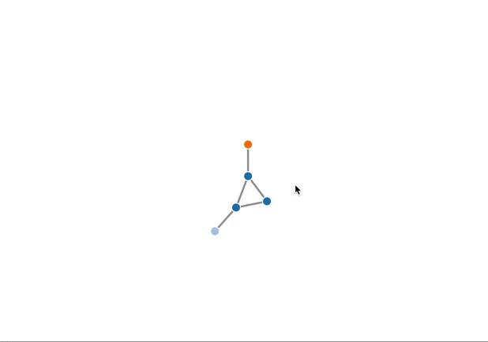

vivagRaph
=========

R package for interactive network plots using VivaGraph js. Built with `htmlwidgets`.  

**Example Use**

```
Nodes = data.frame(nodeName=c('Homer','Bart','Lisa','Milhouse','Lenny'), group=c(1,1,1,2,3))
Edges = data.frame(source=c(0,1,0,1,0),target=c(1,2,2,3,4))
vivagRaph(nodes=Nodes,edges=Edges)
```



**Installation**
```
devtools::install_github('keeganhines/vivagRaph')
library(vivagRaph)
```


